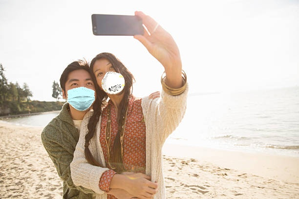
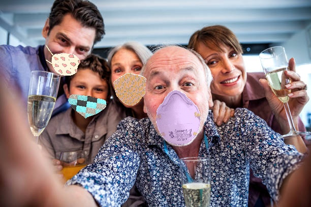
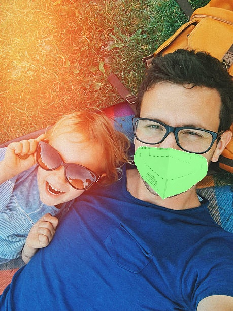
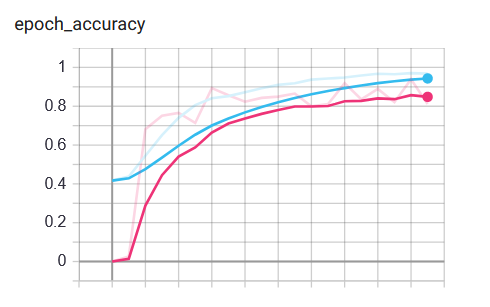
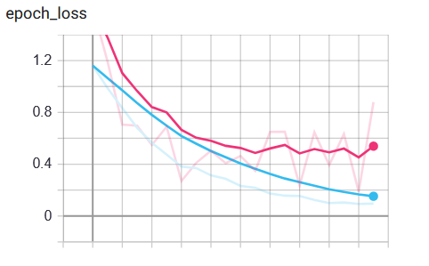

<table>
<tr>
<td width="90"></td>
<td><h1>Masks-Image-Classification</h1></td>
</tr>
</table>
  
**Masks-Image-Classification** is the first project of 052359 - ARTIFICIAL NEURAL NETWORKS AND DEEP LEARNING course of POLITECNICO DI MILANO assigned in 2020/2021, whose details are available at the challenge description page: 
👉[Kaggle Challenge Description](https://www.kaggle.com/competitions/artificial-neural-networks-and-deep-learning-2020/overview/description). 

## Image Classification - Problem Description
>In the specific, the solution must discriminate between images depending on the following cases: 1) All the people in the image are wearing a mask, 
>2) No person in the image is wearing a mask, 3) Someone in the image is not wearing a mask. In the following 3 examples of image from the training belonging 
>to the three cases (Up-Left (1), Up-Right (3), Bottom (3)).

||||
|---|---|---|

## Dataset structure
- Two folders:
  - training: 5614 images
  - test: 450 images
- Training images per class:
  - 0 : 1900
  - 1 : 1897
  - 2 : 1817
- Ground Truth:
  - Labels for images are provided in the *train_gt.json file.

## VGG16 
The task is solved by implementing a Transfer Learning approach, thus by using an already trained VGG16 model (only the Convolutional part) and appending a learnable Fully Connected
layers to classify the images into the three main requested classes.  
The adopted VGG16 model is shown in the following figure:

## Tensorboard Results:
The results regarding the training/validation losses and the respective reached accuracy during the learning are shown below:  

|||
|---|---|
